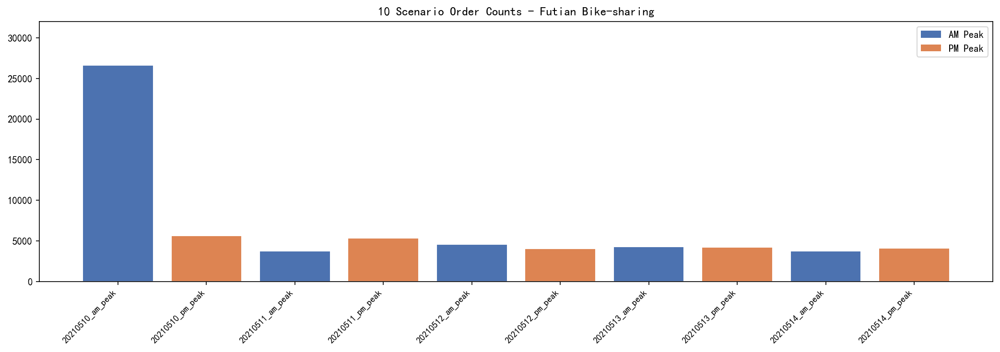
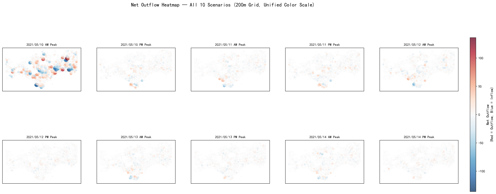
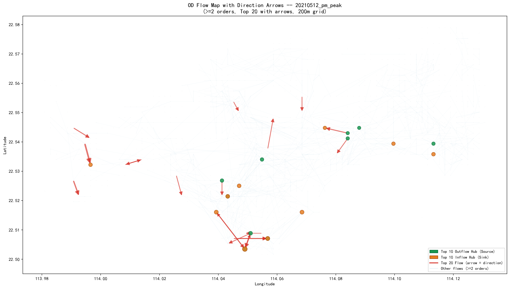
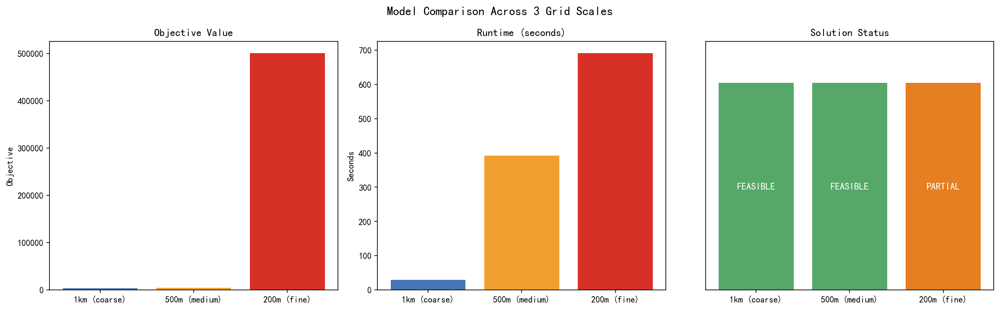
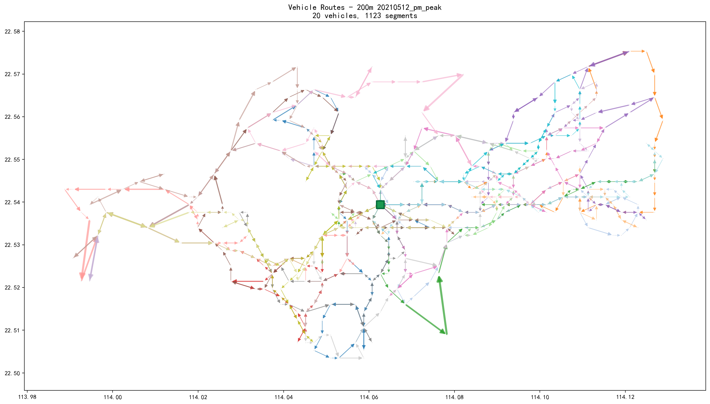
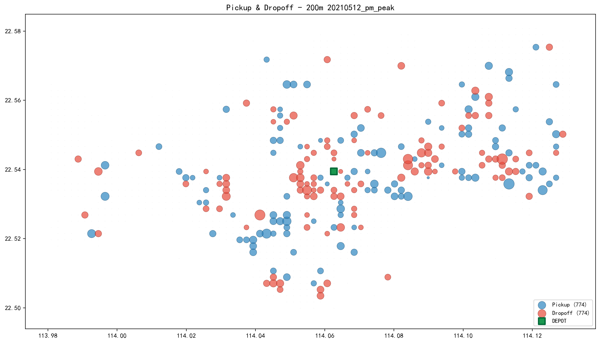
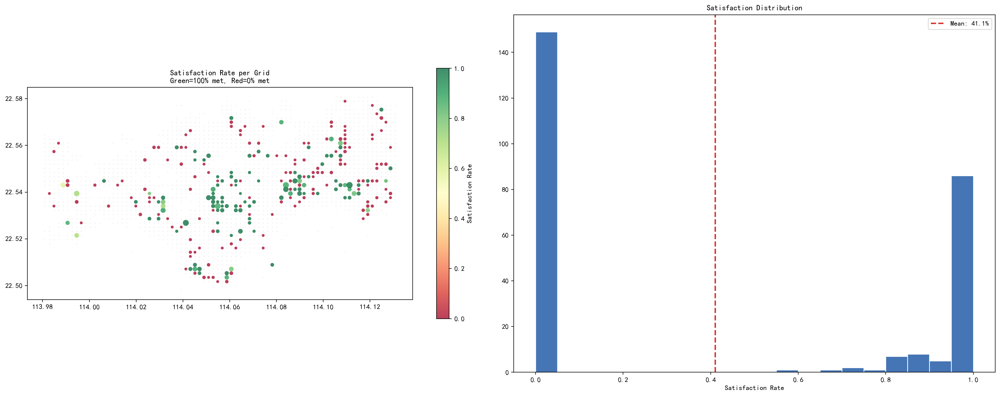
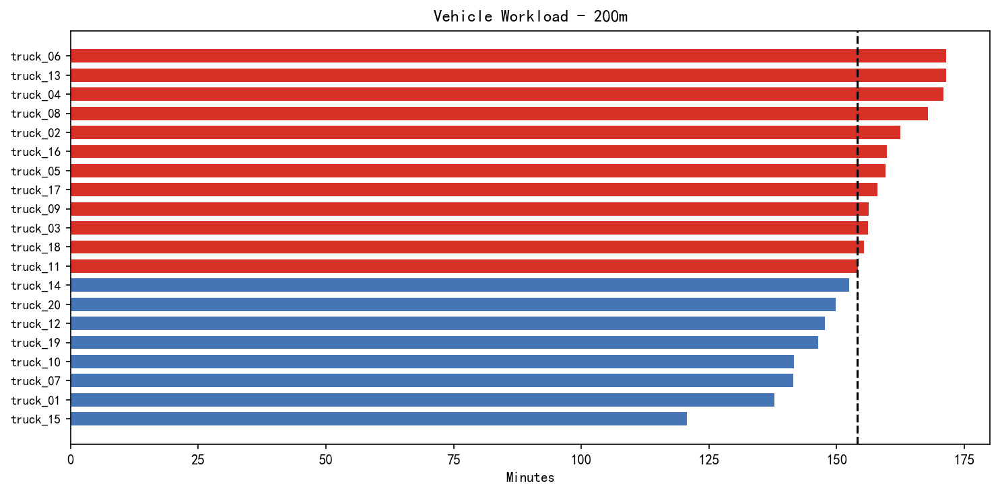
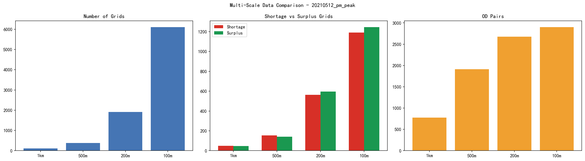
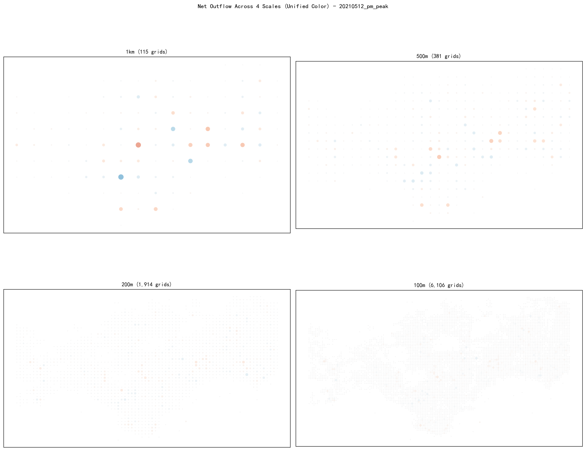

# 深圳福田区共享单车再平衡分析与可视化 — 最终报告

> **项目**：运筹学大作业 — 深圳共享单车区域再平衡优化  
> **区域**：深圳市福田区  
> **时间**：2021年5月10日–14日（周一至周五），早晚高峰  
> **数据规模**：原始样本 291,000 条，清洗后 69,357 条福田相关订单  
> **负责人**：结果分析与可视化

---

## 1. 项目概述

### 1.1 问题背景

共享单车在城市中的分布天然不均衡——早高峰大量单车从住宅区流向商业区和地铁站，晚高峰则反向流动。这种供需时空错配导致部分区域"一车难求"，而另一区域车辆堆积。**再平衡（Rebalancing）** 即通过调度车辆将富余区域的单车运往短缺区域。

### 1.2 分析目标

本报告基于福田区一周早晚高峰的共享单车订单数据，结合启发式调度优化模型的求解结果，完成以下分析：

1. 识别各场景下供需失衡的空间分布
2. 追踪 OD 流向，理解单车流动规律
3. 可视化调度车路线和装卸操作
4. 评估模型满足率和工作量均衡性
5. 对比不同网格尺度的分析效果

### 1.3 数据概览

| 指标 | 数值 |
|---|---|
| 原始订单样本 | 291,000 |
| 清洗后福田相关订单 | 69,357 |
| 分析场景数 | 10（5个工作日 × 早晚高峰） |
| 网格尺度 | 1km / 500m / 200m / 100m |
| 模型求解尺度 | 1km / 500m / 200m |
| 调度车辆数 | 20 辆 |

---

## 2. 需求分析 — 供需失衡的空间格局

### 2.1 场景订单量对比

**关键发现**：

- **周一早高峰异常**：`20210510_am_peak` 订单量达 26,664，是其他场景的 5–7 倍。原因可能是：（1）抽样时该窗口数据密度更高；（2）周一早高峰叠加周末积压的通勤需求。
- **工作日之间较稳定**：周二至周五各场景订单量在 3,758–5,630 之间，波动较小。
- **早晚高峰差异不显著**：除周一外，早晚高峰订单量基本持平。

### 2.2 短缺/富余空间分布

**关键发现**：

1. **空间聚集效应显著**：短缺和富余网格成片分布，而非随机散布。短缺集中在住宅区和办公区周边，富余集中在交通枢纽。
2. **早晚高峰模式基本对称**：早高峰的短缺区域 ≈ 晚高峰的富余区域，验证了通勤潮汐规律。
3. **周一早高峰失衡最严重**：短缺量达 7,508，是其他场景的 3–4 倍。
4. **供需总量守恒**：每个场景的总短缺量 ≈ 总富余量，系统车辆守恒——问题核心是**空间分布不均**。

| 场景 | 短缺网格 | 富余网格 | 总短缺量 |
|---|---|---|---|
| 周一早高峰 | 831 | 769 | 7,508 |
| 周一晚高峰 | 607 | 653 | 2,282 |
| 周二–周五（均值） | ~570 | ~610 | ~2,000 |

### 2.3 Net Outflow 热力图

Net Outflow = departures − arrivals。红色表示净流出（出发地），蓝色表示净流入（到达地）。

**关键发现**：早高峰净流出集中在福田区北部和西部的住宅密集区，净流入集中在南部商业区和地铁沿线。晚高峰则基本相反——符合"早出晚归"的通勤模式。

---

## 3. OD 流向分析 — 单车从哪骑到哪

### 3.1 OD 流基本特征

| 指标 | 200m 尺度 |
|---|---|
| OD 对总数 | 39,848 |
| 跨场景去重后 | 31,161 |
| 单次骑行 OD 对占比 | 65.1% |
| 自环流（同网格内）占比 | 2.3% |
| 最大单 OD 流量 | 30 次 |

**关键发现**：OD 流极度稀疏——80.8% 的 OD 对仅出现在 1 个场景中，只有 251 个 OD 对出现在 ≥5 个场景中，仅 1 个 OD 对在所有 10 个场景中都出现。

### 3.2 OD 流向地图

图中红色箭头表示 Top 20 最大 OD 流的方向，绿色点为出发枢纽（Outflow Hub），橙色点为到达枢纽（Inflow Hub）。

**关键发现**：

1. **流量枢纽空间集中**：少数网格承担了大量出发/到达流量。前 30 个枢纽网格覆盖了大部分 OD 活动。
2. **稳定 OD 对是调度路线的骨架**：虽然数量仅占 0.8%，但稳定 OD 对（出现在 ≥5 场景）覆盖了绝大部分流量。
3. **早晚高峰流向镜像**：AM vs PM 对比图（`03_am_pm_od_compare_20210512.png`）清楚展示了流向的反转。

### 3.3 最稳定的 OD 对

| OD 对 | 出现场景数 | 平均订单数 | 备注 |
|---|---|---|---|
| 023/014 → 024/017 | 10/10 | 11.1 | 唯一全场景出现的 OD 对 |
| 035/033 → 037/034 | 9/10 | 2.3 | — |
| 045/032 → 042/032 | 9/10 | 3.6 | — |
| 024/017 → 023/014 | 8/10 | 8.2 | 与第 1 条方向相反 |

---

## 4. 模型结果 — 调度优化效果评估

### 4.1 求解摘要

| 尺度 | 求解状态 | 目标值 | 运行时间 | 整体满足率 |
|---|---|---|---|---|
| 1km | ✅ 可行解 | 3,684 | 29s | 80.2% |
| 500m | ✅ 可行解 | 4,506 | 393s | 84.1% |
| 200m | ⚠️ 未完全满足 | 500,593 | 691s | 56.7% |

### 4.2 车辆路线

20 辆调度车从 DEPOT（福田区中心）出发，按箭头方向依次访问服务网格，完成装卸操作后返回 DEPOT。

- 总行驶距离因尺度而异
- 路线覆盖了福田区主要失衡区域
- 路线之间存在一定的区域分工

### 4.3 装卸操作

蓝圈 = Pickup（装车），红圈 = Dropoff（卸车）。装卸总量相等（774 辆），符合车辆守恒。空间分布与 02 notebook 中的短缺/富余分析一致——装车点对应富余网格，卸车点对应短缺网格。

### 4.4 短缺满足率

**200m 尺度**：
- 短缺网格数：260
- 总短缺：1,366 辆
- 已满足：774 辆
- 未满足：592 辆
- 整体满足率：56.7%

满足率分布呈两极化——部分网格完全满足，部分完全未满足。这是启发式方法的典型特征：优先服务大需求网格，小需求网格可能被忽略。

### 4.5 车辆工时

20 辆车工时在 120.6–171.5 分钟之间，均值 154.1 分钟。最长工时与最短工时相差约 51 分钟，工作量基本均衡但仍有优化空间。

### 4.6 目标函数分解

| 组成部分 | 200m 值 | 含义 |
|---|---|---|
| Makespan | 171.5 min | 最长单车完成时间 |
| Total Vehicle Time | 3,081.3 min | 所有车辆总工时 |
| Total Unmet | 592 辆 | 未满足的短缺需求 |
| Total Served | 774 辆 | 成功满足的需求 |

---

## 5. 多尺度对比

### 5.1 数据规模增长

| 尺度 | 网格数 | 短缺网格 | 富余网格 | OD 对数 |
|---|---|---|---|---|
| 1km | 115 | 50 | 46 | 775 |
| 500m | 381 | 155 | 142 | 1,912 |
| 200m | 1,914 | 563 | 595 | 2,676 |
| 100m | 6,106 | 1,190 | 1,246 | 2,901 |

从 1km 到 100m，网格数增长 53 倍，OD 对增长 3.7 倍。100m 尺度 OD 对数增长放缓，因为极细网格下大量 OD 对退化为单次骑行。

### 5.2 尺度推荐

| 用途 | 推荐尺度 | 理由 |
|---|---|---|
| **建模优化** | **500m** | 求解质量和精度的平衡点，84.1% 满足率 |
| **可视化展示** | **200m** | 约一个街区的分辨率，可读性和信息量最佳 |
| **宏观概览** | 1km | 快速扫描大范围模式 |
| **微热点检测** | 100m | 仅用于局部探索，不推荐用于建模 |

---

## 6. 调度策略建议

### 6.1 常态化调度路线

基于跨场景稳定的 OD 对（如 `023/014 ↔ 024/017`），建议在这些固定 OD 走廊上设置常态化调度路线。这些稳定 OD 对虽然数量少，但覆盖了大部分流量。

### 6.2 分时段差异化调度

- **早高峰（7-10h）**：从南部商业区和地铁站周边（富余）调车到北部和西部住宅区（短缺）
- **晚高峰（17-20h）**：方向相反——从住宅区（富余）调车到商业区（短缺）
- **周一早高峰**：需增派调度资源，短缺量是平时的 3–4 倍

### 6.3 优先服务节点

每个场景中 `abs_imbalance` 最大的 Top 10–30 网格应作为优先服务节点。跨场景重复出现的失衡热点（如 `200m_r027_c068` 等）可能需要设置固定调度桩。

### 6.4 模型改进方向

1. **增加车辆数**：200m 尺度下 20 辆车不足以覆盖所有短缺（592 辆未满足）
2. **改进启发式算法**：提高小需求网格的满足率，减少"完全未满足"的网格
3. **分区域求解**：将福田区分为多个子区域独立求解，降低问题规模

---

## 7. 可视化产出清单

### Notebook

| 文件 | 内容 |
|---|---|
| `notebooks/01_demand_overview.ipynb` | 10 场景订单量、早晚高峰对比、供需统计 |
| `notebooks/02_surplus_shortage_map.ipynb` | 短缺/富余地图、Net Outflow 热力、失衡排名 |
| `notebooks/03_od_flow_analysis.ipynb` | OD 流排名、箭头流向图、枢纽分析、早晚对比、稳定性 |
| `notebooks/04_model_results_viz.ipynb` | 求解摘要、箭头路线图、装卸地图、满足率、工时、目标分解 |
| `notebooks/05_multi_scale_comparison.ipynb` | 4 尺度对比、聚合验证、模型效果汇总 |

### 交互式地图

`outputs/figures/02_folium_map_*.html`（10 个文件）— 每个场景的可缩放、可点击交互式地图，在浏览器中打开。

### 静态图表

`outputs/figures/` 目录下共 43 个 PNG 图表文件。

---

## 8. 局限性与改进方向

1. **数据抽样偏差**：当前数据为高峰窗口代表页抽样，非完整高峰全量数据。周一早高峰数据量异常可能是抽样偏差而非真实需求差异。
2. **仅一个场景有模型结果**：模型仅对 `20210512_pm_peak` 求解，无法全面评估模型在不同场景下的鲁棒性。
3. **缺少调度成本的经济评估**：未计算调度车的运营成本（油耗、人力等），无法做成本效益分析。
4. **动态调度未考虑**：模型为静态单次优化，未考虑调度过程中的实时需求变化。
5. **DEPOT 位置假设**：所有车辆从单一 DEPOT 出发，实际可能需要多个分布式调度中心。

---

*报告完成日期：2026年6月13日*
